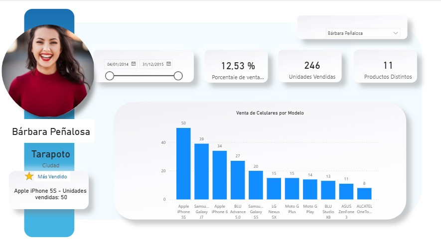
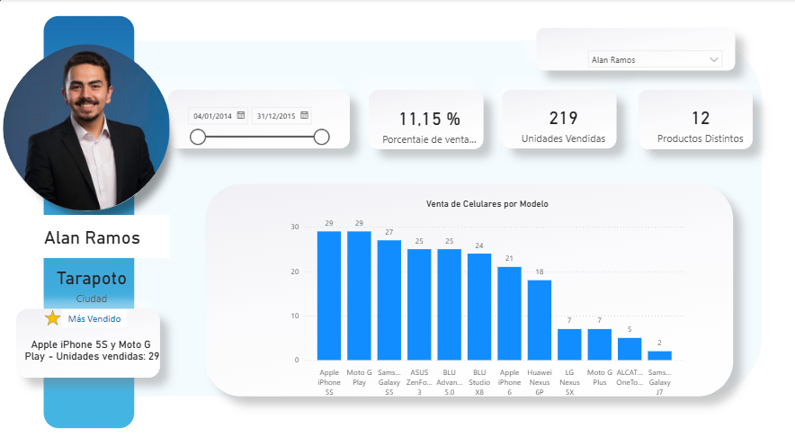

# Análisis de Performance Retail: Telefonía Móvil

## Descripción del Proyecto
Este proyecto consiste en el desarrollo de una solución de **Business Intelligence** para el monitoreo de ventas en el sector retail. El objetivo principal fue centralizar datos transaccionales de diversos puntos de venta (Rioja, Tarapoto, Moyobamba) y transformarlos en un **dashboard interactivo** que facilite la toma de decisiones gerenciales sobre el desempeño de la fuerza de ventas.

---

## Visualización del Dashboard
Aquí se muestra la interfaz principal y el sistema de perfilamiento dinámico:

---

##  Stack Tecnológico
* **Excel:** Utilizado para el almacenamiento de la data cruda y la **estructuración de tablas maestras**.
* **Power BI / Power Query:** Implementado para el proceso de **ETL**, modelado relacional y diseño de la interfaz de usuario.

## Arquitectura y Modelado de Datos
Para garantizar la integridad y escalabilidad de los reportes, implementé un **Modelo en Estrella (Star Schema)** conectando tres entidades clave:
* **Tabla de Hechos (`Ventas`):** Contiene el registro histórico de transacciones (fechas, SKUs, unidades).
* **Dimensión Vendedores:** Maestro de datos con **geolocalización** y atributos de perfil (fotografía).
* **Dimensión Productos:** Catálogo técnico con estructura de precios, costos y **niveles de stock**.

##  Inteligencia de Datos (DAX)
Se desarrollaron medidas personalizadas para transformar datos planos en **indicadores de rendimiento (KPIs)** accionables:
* **Análisis de Participación:** Uso de `CALCULATE` y `ALL` para determinar el **peso porcentual** de cada vendedor frente al total corporativo.
* **Top Performance Dinámico:** Lógica avanzada con `TOPN` para identificar automáticamente el **producto estrella** según el contexto de filtrado.
* **Diversificación de Cartera:** Implementación de `DISTINCTCOUNT` para auditar la variedad de modelos gestionados por representante.

##  Insights y Resultados Clave
El análisis del periodo permitió extraer hallazgos estratégicos para la gerencia:
* **Liderazgo Comercial:** **Andrés Mejía** se posiciona como el representante líder con un **27.44%** de contribución al volumen total.
* **Mix de Productos:** Los modelos **iPhone 5S** y **Moto G Play** se identificaron como los productos de mayor rotación y demanda regional.
* **Optimización Operativa:** El sistema permite una **auditoría visual inmediata**, reduciendo el tiempo de revisión de desempeño individual en un entorno 100% dinámico.

---
**Desarrollado por:** Frank Orreaga
**Perfil:** Analista de Datos Junior | Ingeniería Química  
**Contacto: [Frank Orreaga - LinkedIn](https://www.linkedin.com/in/frank-orreaga)
